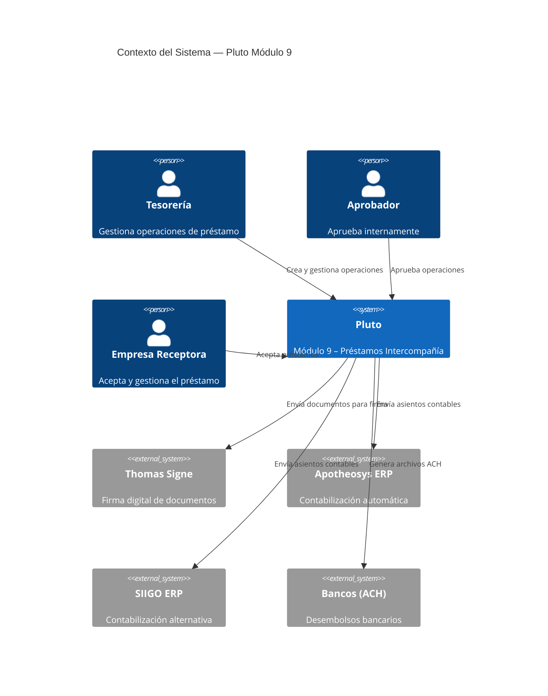
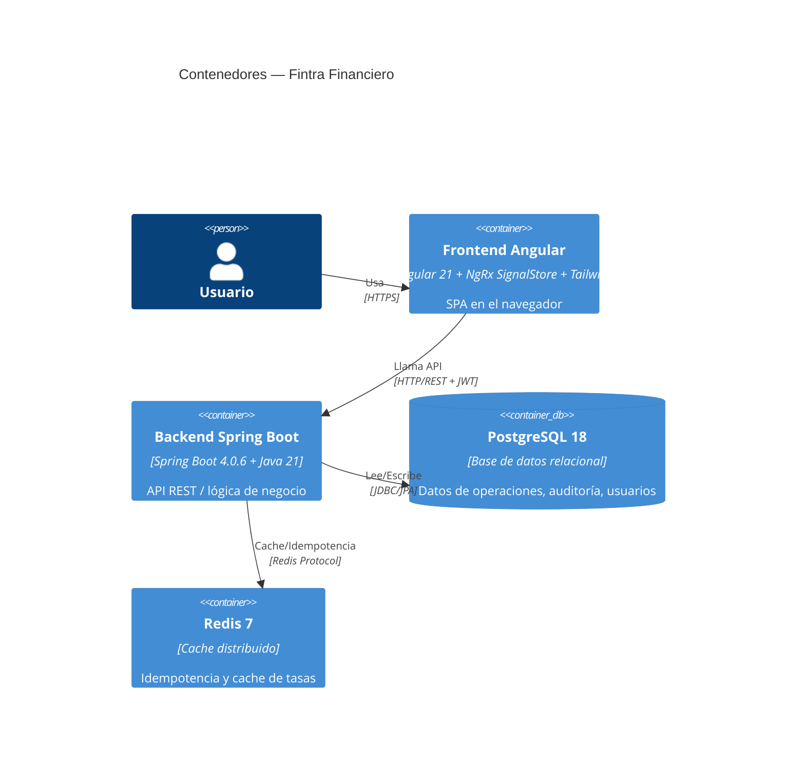

# Visión del Sistema — Fintra Financiero Módulo 9

## Contexto

Fintra S.A.S. necesita digitalizar y automatizar el proceso de **préstamos intercompañía** entre empresas del grupo. El sistema debe manejar el ciclo de vida completo: creación → aprobación interna → aceptación empresa → firma digital → desembolso → seguimiento de abonos → liquidación mensual.

## Diagrama C4 — Nivel 1 (System Context)

## Diagrama C4 — Nivel 2 (Container)

